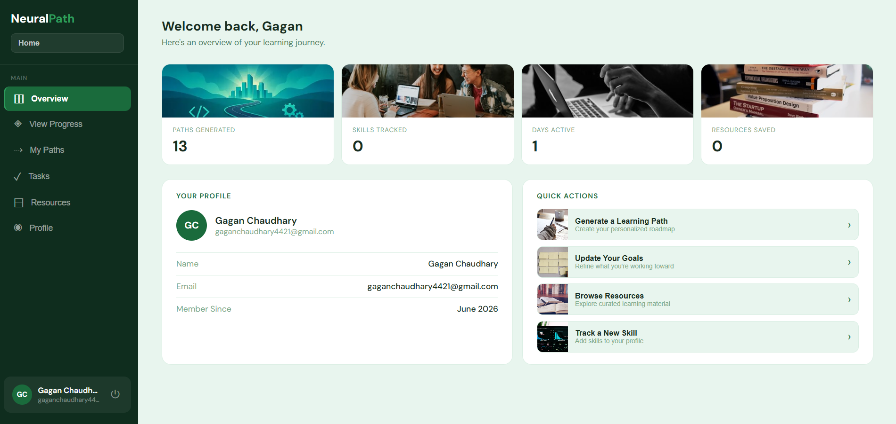

### ATH Hackathon 0.1 – 2026

# NeuralPath — AI-Powered Personalized Learning Path Generator

## Problem Statement

**PS-02: AI-Powered Personalized Learning Path Generator**

Students and self-learners often struggle to find a clear, structured path
to learn new skills. With countless scattered resources online, it becomes
difficult to know what to learn, in what order, and from where — leading to
confusion, wasted time, and inconsistent progress.

## Proposed Solution

NeuralPath is an AI-powered platform that generates personalized learning
roadmaps based on a user's goals, current skill level, and learning
preferences. It analyzes skill gaps, recommends a structured step-by-step
path, curates relevant resources for each topic, and tracks the user's
progress — all in one place.

## Features

- **AI-Generated Learning Paths** — Personalized roadmaps powered by Groq (LLaMA 3.3 70B)
- **Visual Roadmap** — Interactive step-by-step learning journey
- **Progress Tracking** — Dashboard with analytics and stats
- **Skill Gap Detection** — Identifies what to learn based on goals
- **Curated Resources** — Auto-fetched articles, videos, and docs per topic
- **Authentication** — Secure login, signup, and password reset flow
- **AI Explainer Videos** — Auto-generated topic explainer videos using Remotion

## Technology Stack

- **Frontend:** React + Vite, React Router, Recharts
- **Backend:** FastAPI (Python), MySQL
- **AI:** Groq API (llama-3.3-70b-versatile)
- **Video Generation:** Remotion
- **Auth:** JWT, bcrypt, Gmail SMTP (password reset)
- **Deployment:** Vercel (Frontend), Render (Backend)

## Screenshots

### Landing Page


### Dashboard



### Learning Path


## Setup & Usage Instructions

### Frontend

```bash
npm install
npm run dev
```

### Backend

```bash
cd backend
pip install -r requirements.txt
uvicorn main:app --reload
```

### Environment Variables

Create a `.env` file in `backend/` with:
DB_HOST=localhost
DB_PORT=3306
DB_USER=root
DB_PASSWORD=yourpassword
DB_NAME=learningpath_db
GMAIL_USER=your@gmail.com
GMAIL_APP_PASSWORD=your_app_password
JWT_SECRET=your_jwt_secret
JWT_ALGORITHM=HS256
JWT_EXPIRE_MINUTES=10080
GROQ_API_KEY=your_groq_api_key

## Team Details

- **Gagan Chaudhary**

---
